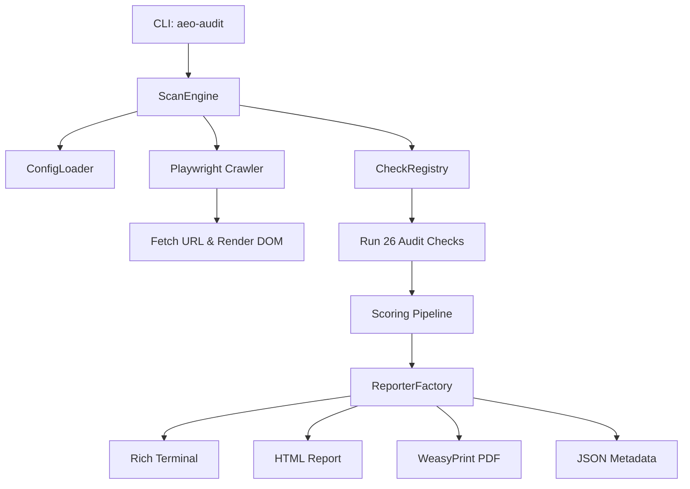

# AEO Auditor CLI

[](https://pypi.org/project/aeo-audit/)
[](https://github.com/ayushjangid/aeo-audit/actions)
[](https://opensource.org/licenses/MIT)

Scan websites and score their **Agent/Engine Optimization (AEO) readiness** (0-100) across 5 dimensions: Discovery, Identity, Capabilities, Commerce, and Trust.

---

## Architecture Overview



---

## Installation

### 1. System Dependencies (Required for WeasyPrint PDF)
PDF reports require external layout libraries installed on your OS:

- **macOS (Homebrew)**:
  ```bash
  brew install pango cairo gdk-pixbuf upx
  ```
- **Ubuntu/Debian**:
  ```bash
  sudo apt-get update
  sudo apt-get install -y libpango-1.0-0 libcairo2 libgdk-pixbuf-2.0-0 upx
  ```

### 2. Install Methods

#### Method A: Via `pipx` (Recommended for Python CLI apps)
```bash
pipx install aeo-audit
```

#### Method B: Standalone Binary Installer (No Python Needed)
Run the automated installation script:
```bash
curl -fsSL https://raw.githubusercontent.com/ayushjangid/aeo-audit/main/scripts/install.sh | bash
```

#### Method C: Source installation
```bash
git clone https://github.com/ayushjangid/aeo-audit.git
cd aeo-audit
pip install -e .
```
> [!NOTE]
> If WeasyPrint throws rendering or font warnings on Python 3.14+, we recommend pinning `pydyf==0.10.0`.

---

## Quick Start

Scan a site and generate reports using the `scan` command:

```bash
# Terminal report (default)
aeo-audit scan https://api.example.com --format terminal

# Premium HTML report with embedded graphs
aeo-audit scan https://api.example.com --format html --output report.html

# Accessible PDF report
aeo-audit scan https://api.example.com --format pdf --output report.pdf

# Machine-readable JSON report
aeo-audit scan https://api.example.com --format json --output report.json
```

---

## Configuration (`config.yaml`)

`aeo-audit` uses a configuration file to define grading scales, category scores, and check weights.

### Category Scoring Structure

| Category | Default Weight | Target Objectives |
|----------|----------------|-------------------|
| **Discovery** | `0.25` | Bot accessibility policies, Sitemap, DNS, and MCP discovery. |
| **Identity** | `0.15` | Trust ownership validation (DID Docs, OAuth, Wallet Hints). |
| **Capabilities** | `0.25` | Interface documentation (OpenAPI, GraphQL schemas, webhooks). |
| **Commerce** | `0.20` | Dynamic agent transactions (agent-pricing.json, Stripe/Crypto). |
| **Trust** | `0.15` | Audit Logs, SLA page, live checks, error structures. |

For a complete layout of configuration schema details, check out [CONFIG_REFERENCE.md](file:///Users/ayushjangid/Developer/aeo-audit-cli/docs/CONFIG_REFERENCE.md).

---

## CI/CD Pipeline Integration

You can easily configure `aeo-audit` as a compliance block (exits with code `2` if scores drop below requirements). Here's a brief example for **GitHub Actions**:

```yaml
- name: AEO Compliance Gate
  run: aeo-audit scan https://preview.example.com --fail-on-grade B --format terminal
```

See [CI_RECIPES.md](file:///Users/ayushjangid/Developer/aeo-audit-cli/docs/CI_RECIPES.md) for GitHub Actions, GitLab CI, and Git hooks code snippets.

---

## Extending: Custom Check Plugins

To implement custom checking rules, subclass `BaseCheck` and expose it under the `aeo_audit.checks` entrypoint.

See [CUSTOM_CHECKS.md](file:///Users/ayushjangid/Developer/aeo-audit-cli/docs/CUSTOM_CHECKS.md) for a complete template walkthrough.

---

## FAQ

#### 1. How do I install Playwright browser binaries?
If running the scanner for the first time, you may need to install Playwright's headless browser binaries:
```bash
playwright install chromium
```

#### 2. Where is the SQLite cache stored?
By default, the SQLite cache database is created in your working directory as `.aeo_cache.db` to speed up consecutive audit scans. This can be customized or disabled using `--no-cache`.

#### 3. Why are my PDF files empty or raising font errors?
Ensure you have installed the native `pango` and `cairo` system dependencies (see Step 1 of installation).
