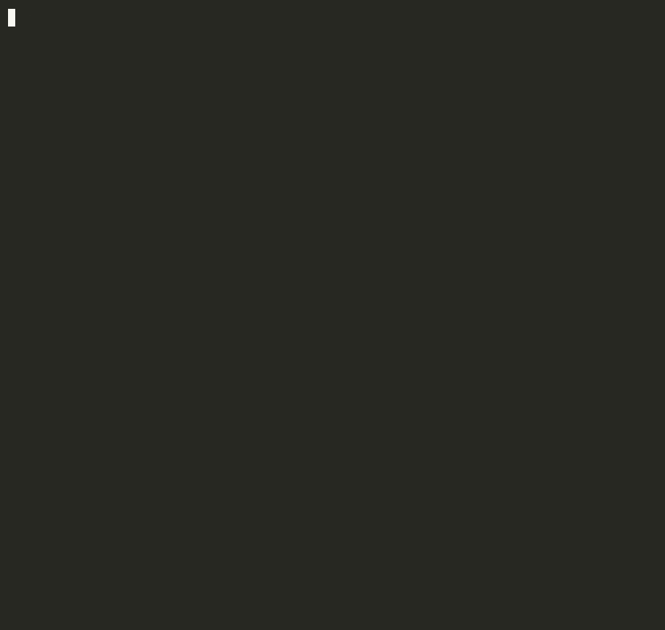
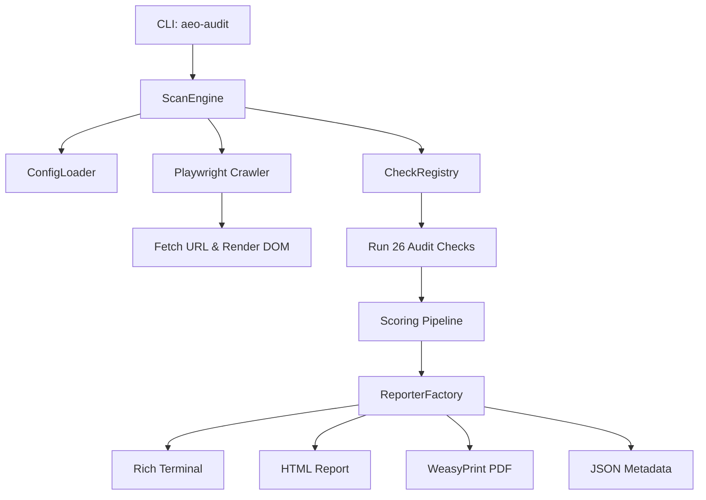

# AEO Auditor CLI

[](https://pypi.org/project/aeo-audit/)
[](https://github.com/AJ-EN/aeo-audit/actions)
[](https://opensource.org/licenses/MIT)
[](https://www.python.org/downloads/)

**PageSpeed for AI agents.** Scan any website and score its **Agent/Engine Optimization (AEO) readiness** across 5 dimensions — Discovery, Identity, Capabilities, Commerce, and Trust — then get a graded report with prioritized, actionable fixes.

Grades are **relative**: a site is ranked against a benchmark corpus (A = top tier of agent-readiness today), so the score stays a meaningful, movable target while agent-native standards are still emerging.



**🔗 [Live leaderboard, methodology & example report → aj-en.github.io/aeo-audit](https://aj-en.github.io/aeo-audit/)**

---

## Architecture Overview



---

## Installation

### 1. System Dependencies (Required for WeasyPrint PDF)

PDF reports require external layout libraries installed on your OS:

- **macOS (Homebrew)**:

  ```bash
  brew install pango cairo gdk-pixbuf upx
  ```

- **Ubuntu/Debian**:

  ```bash
  sudo apt-get update
  sudo apt-get install -y libpango-1.0-0 libcairo2 libgdk-pixbuf-2.0-0 upx
  ```

### 2. Install Methods

#### Method A: Via `pip` / `pipx` (Recommended)

```bash
pipx install aeo-audit      # isolated CLI install (recommended)
# or:  pip install aeo-audit

# bleeding edge from main:
# pipx install git+https://github.com/AJ-EN/aeo-audit.git
```

That's it — on your first scan, `aeo-audit` downloads the headless Chromium it needs automatically (one-time, ~30s). To pre-install it yourself:

```bash
playwright install chromium
```

#### Method B: Standalone Binary Installer (No Python Needed)

Run the automated installation script:

```bash
curl -fsSL https://raw.githubusercontent.com/AJ-EN/aeo-audit/main/scripts/install.sh | bash
```

> [!IMPORTANT]
> The binary still needs a Chromium runtime. If a scan reports a missing browser,
> install one with `playwright install chromium` and point the binary at it:
> `export PLAYWRIGHT_BROWSERS_PATH="$HOME/Library/Caches/ms-playwright"` (macOS)
> or the equivalent cache path on your OS.

#### Method C: Source installation

```bash
git clone https://github.com/AJ-EN/aeo-audit.git
cd aeo-audit
pip install -e .
playwright install chromium
```

> [!NOTE]
> If WeasyPrint throws rendering or font warnings on Python 3.14+, we recommend pinning `pydyf==0.10.0`.

---

## Quick Start

Scan a site and generate reports using the `scan` command:

```bash
# Terminal report (default)
aeo-audit scan https://api.example.com --format terminal

# Premium HTML report with embedded graphs
aeo-audit scan https://api.example.com --format html --output report.html

# Accessible PDF report
aeo-audit scan https://api.example.com --format pdf --output report.pdf

# Machine-readable JSON report
aeo-audit scan https://api.example.com --format json --output report.json
```

---

## Scoring & Grading

Each of the 26 checks returns a raw score (`0.0`–`1.0`). Checks roll up into 5 weighted category scores, which roll up into a single `0–100` overall score. The grade is then assigned **by percentile rank against a benchmark corpus** — so it reflects how a site compares to the field, not an absolute bar that nobody clears yet.

### Category weights

`aeo-audit` is **foundation-weighted**: dimensions where well-run APIs already differ today (Trust, Capabilities, Discovery) carry the most weight, while emerging agent-native dimensions (Identity, parts of Commerce) contribute upside without dominating the score.

| Category | Weight | What it measures |
|----------|--------|------------------|
| **Discovery** | `0.25` | robots/agent access, sitemap, `.well-known`, DNS, and MCP discovery. |
| **Capabilities** | `0.25` | Interface docs — OpenAPI, JSON Schema, GraphQL, async webhooks. |
| **Trust** | `0.25` | SLA/status page, structured errors, health checks, audit logs. |
| **Commerce** | `0.15` | Agent transactions — pricing, Stripe/crypto hints, usage metering. |
| **Identity** | `0.10` | Ownership & auth — DID docs, OAuth metadata, wallet hints. |

### Grade bands (percentile)

| Grade | Percentile | Meaning |
|-------|-----------|---------|
| **A** | top 10% | Leading the field on agent-readiness. |
| **B** | top 30% | Strong; a few high-leverage gaps. |
| **C** | top 60% | Foundational signals present, frontier gaps. |
| **D** | top 85% | Minimal agent-readiness. |
| **F** | bottom 15% | Not addressed. |

Weights, thresholds, and grade bands are all defined in `config.yaml` and overridable via a custom config. See [docs/CONFIG_REFERENCE.md](docs/CONFIG_REFERENCE.md).

---

## CI/CD Pipeline Integration

You can easily configure `aeo-audit` as a compliance block (exits with code `2` if scores drop below requirements). Here's a brief example for **GitHub Actions**:

```yaml
- name: AEO Compliance Gate
  run: aeo-audit scan https://preview.example.com --fail-on-grade B --format terminal
```

See [docs/CI_RECIPES.md](docs/CI_RECIPES.md) for GitHub Actions, GitLab CI, and Git hooks code snippets.

---

## Extending: Custom Check Plugins

To implement custom checking rules, subclass `BaseCheck` and expose it under the `aeo_audit.checks` entrypoint.

See [docs/CUSTOM_CHECKS.md](docs/CUSTOM_CHECKS.md) for a complete template walkthrough.

---

## FAQ

#### 1. How do I install Playwright browser binaries?

If running the scanner for the first time, you may need to install Playwright's headless browser binaries:

```bash
playwright install chromium
```

#### 2. Where is the SQLite cache stored?

By default, the SQLite cache database is created in your working directory as `.aeo_cache.db` to speed up consecutive audit scans. This can be customized or disabled using `--no-cache`.

#### 3. Why are my PDF files empty or raising font errors?

Ensure you have installed the native `pango` and `cairo` system dependencies (see Step 1 of installation).
